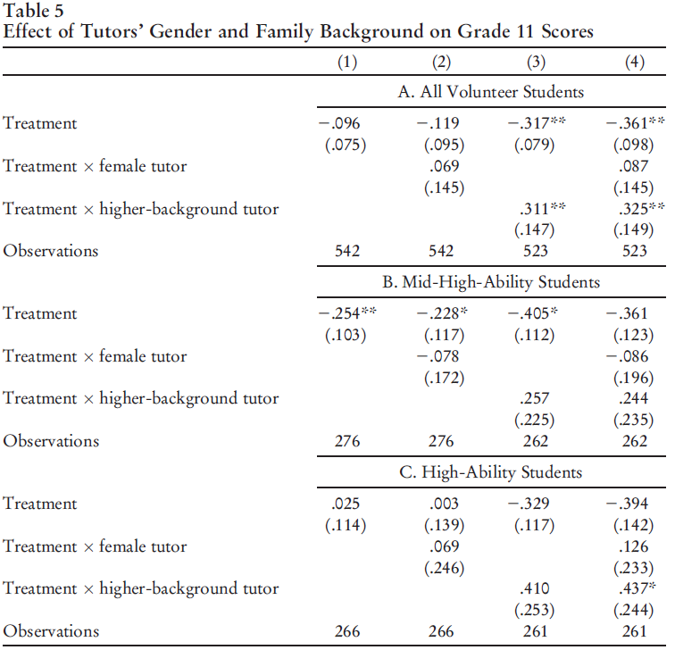
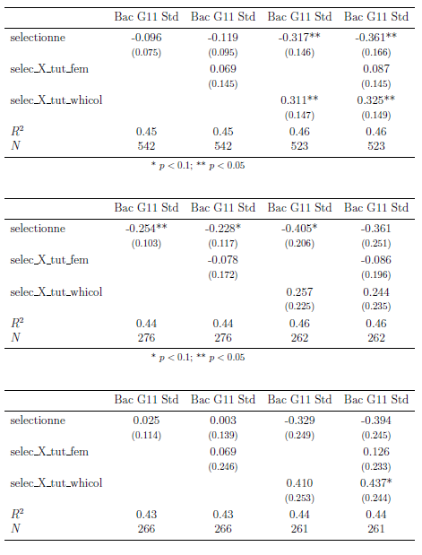

# [Journal of Labor Economics, 2020, vol. 38, no. 2] [A Pleasure That Hurts: The Ambiguous Effects of Elite Tutoring on Underprivileged High School Students] Validation and Replication results

Data description
----------------

### Data Sources

Data is provided and has been uploaded as the file Data_for_A_Pleasure_That_Hurts_replication.dta 

### Analysis Data Files

- [ ] Analysis data files mentioned, provided. File names listed below.
> > find . Data_for_A_Pleasure_That_Hurts_replication.dta 

Data deposit
------------

Code description
----------------
There are seven files. 
1. One provided Stata file. 
2. One Stata do file.
3. One pdf guide.
4. Four Stata .ado files.

Stated Requirements
---------------------

You should create an empty folder called "tables" within that folder; some of the tables will be outputted in that directory as .tex files in addition to being printed out in Stata.

- [ ] Software Requirements 
  - [ ] Stata
    - command outreg2. (run the following command in Stata: ssc install outreg2)

Actual Requirements
---------------------

There is another command that should be run. 

- [ ] Software Requirements 
  - [ ] Stata
    - command outreg. (run the following command in Stata: ssc install outreg)

Computing Environment of the Replicator
---------------------

  > INSTRUCTIONS: This might be automated, for now, please fill in manually. Remove examples that are not relevant, adjust examples to fit special circumstances. Some of this is available from the standard log output in Stata or R. Some frequently used details are below. Some of these details can be found as follows:
>
> - (Windows) by right-clicking on "This PC"
> - (Mac) Apple-menu > "About this Mac"
> - (Linux) see code in `tools/linux-system-info.sh`

- Mac Laptop, MacOS 10.14.6, 8 GB of memory
- CISER Shared Windows Server 2019, 256GB, Intel Xeon E5-4669 v3 @ 2.10Ghz (3 processors)
- CISER Virtual Windows Server 2016, 16GB, Intel Haswell 2.19 Ghz (2 processors)
- BioHPC Linux server, Centos 7.6, 64 cores; 1024GB RAM; 

> INSTRUCTIONS: Please also list the software you used (specific versions). List only the ones you used, add any not listed in the examples:

- StataSE-64

Replication steps
-----------------

1. Download the data file, the do file and the ado files and save in the same folder.
2. Crate a new folder named "tables".
3. Change the direction of the file in the do file. Use YOURLOCATION, clear (where YOURLOCATION is the specific location in your computer).
4. This is important and not specificied in the instructions: In many parts of the code you will find the following: "{outregpath}" substitute it by "YOURLOCATION\tables\" 
5. Install the packages outreg and outreg2. Use: ssc install outreg and ssc install outreg2. (The second one was explained in the guide, but the first one needs to be installed too)
6. Run the ado files.
7. Run the do file. 

Findings
--------

I faced some problems with the reproducibility, but they can be solved by adding some lines to the instructions and adding two lines to the code. Overall I have to say that the authors provided all the materials that were needed in order to reproduce almost all of the tables provided. The do-file is easy to read and the different tables are easy to find. 
With little improvement in the instructions this reproducibility would have been extremely straight forward. 

### Tables

Examples:

- Table 1: Looks the same. (I can only reproduce  the last three columns of the table, because there is no data access in order to produce the first two, as explained in the guide).
- Table 2: Looks the same. Notice that for the cohort of 2011 there is no information about attendance, for this reason there is one row that does not produce information. That row is omitted in the paper. 
- Table 3: Looks the same.
- Table 4: Looks the same.
- Table 5: Differences in columns 3 and 4, in all the treatment (or selectionne) rows. 
- Table 6: Looks the same.

Table 5: Paper version:

Table 5: generated by programs:

Classification
--------------

- [ ] full reproduction with minor issues

I was able to produce all the tables of the papers.

Problems:
1. Table 1: as explained in the "guide" in order to generate columns 1 and 2, we need to access another database. For this reason, as expected we can only produce columns 3-5.
2. Table 5: Some standard errors were different to the ones presented in the paper.
